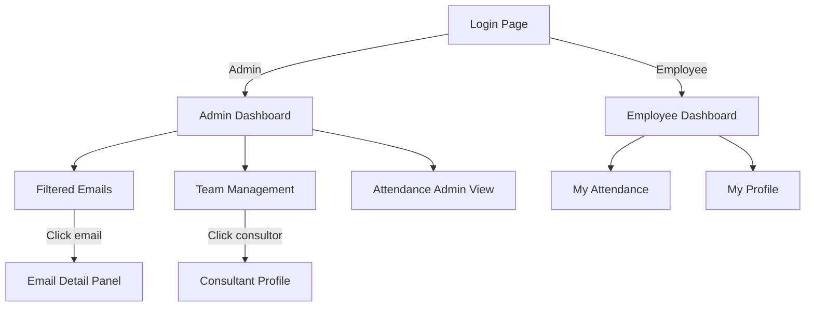

# 🧩 ExpertPartner — Consultancy Operations Hub

> **Suite de gestión empresarial** para consultoras de alto rendimiento. Dos portales diferenciados (Admin y Empleado), control de asistencia en tiempo real, bandeja de emails filtrada por IA y gestión completa del equipo de consultores.

---

## 📐 Sistema de Diseño Global

### Paleta de Colores

| Token              | Valor                 | Uso                                    |
| ------------------ | --------------------- | -------------------------------------- |
| **Deep Navy**      | `#0F172A`             | Sidebar, cabeceras, fondo oscuro       |
| **Emerald Accent** | `#10B981`             | CTAs primarios, estados activos, éxito |
| **Surface (bg)**   | `#F8FAFC`             | Fondo general de la app                |
| **Card Surface**   | `#FFFFFF`             | Tarjetas y contenedores                |
| **Border**         | `#E2E8F0`             | Bordes de cards e inputs               |
| **Text Primary**   | `#191C1E`             | Títulos y cuerpo                       |
| **Text Muted**     | `#45464D`             | Labels secundarios                     |
| **Urgent**         | `#FEE2E2` / `#EF4444` | Badges de urgencia en emails           |
| **Lead Gen**       | `#DBEAFE` / `#3B82F6` | Badges de lead en emails               |
| **Finance**        | `#E5E7EB` / `#6B7280` | Badges de finanzas                     |

### Tipografía — Inter (Google Fonts)

| Escala     | Tamaño | Peso | Uso                                  |
| ---------- | ------ | ---- | ------------------------------------ |
| `h1`       | 36px   | 700  | Títulos de página                    |
| `h2`       | 24px   | 600  | Subtítulos de sección                |
| `h3`       | 20px   | 600  | Cabeceras de tarjeta                 |
| `body-lg`  | 16px   | 400  | Cuerpo de texto                      |
| `body-md`  | 14px   | 400  | Texto de soporte                     |
| `label-sm` | 12px   | 600  | Labels uppercase, cabeceras de tabla |

### Espaciado (Grid 4px)

```
xs: 4px   sm: 8px   md: 16px   lg: 24px   xl: 40px
Sidebar: 260px fijo | Gutter entre cards: 24px | Padding interno: 24px
```

### Elevación

| Nivel   | Descripción        | CSS                                          |
| ------- | ------------------ | -------------------------------------------- |
| 0       | Fondo app          | `background: #F8FAFC`                        |
| 1       | Cards              | `border: 1px solid #E2E8F0` (sin sombra)     |
| 2       | Hover / Floating   | `box-shadow: 0 4px 12px rgba(15,23,42,0.08)` |
| Sidebar | Profundidad máxima | Color `#0F172A` como separación dura         |

---

## 🖼️ Análisis de Pantallas

---

### 1. `login_expert_partner` — Página de Login


**Descripción:** Pantalla de acceso centrada. Fondo gris claro con cuadrícula sutil. Tarjeta blanca flotante con bordes redondeados (8px).

**Elementos UI:**

- Logo/icono de la app + nombre **"Expert Partner"** + subtítulo "Management Suite Access"
- Campo **Email Address** con icono de sobre y placeholder `name@consultancy.com`
- Campo **Password** con icono de candado + link "Forgot password?" alineado a la derecha
- Botón **LOG IN →** negro, ancho completo, uppercase
- Pie: texto legal + link "Contact IT Support"

**Comportamiento esperado:**

- Validación en tiempo real (borde rojo si vacío al submit)
- Redirige a **Admin Dashboard** si rol = admin, a **Employee Dashboard** si rol = employee
- Estado de carga en botón (spinner) mientras autentica
- El input en focus cambia borde a Emerald Green con glow de 2px al 10% de opacidad

---

### 2. `admin_dashboard_expert_partner` — Dashboard del Administrador


**Descripción:** Vista principal del administrador. Layout de dos columnas en el área de contenido. Sidebar oscuro fijo a la izquierda (260px, fondo `#0F172A`).

**Sidebar:**

- Logo + navegación: Dashboard _(activo)_, Emails, Team Management, Attendance, Settings
- Estado activo: barra verde de 4px en borde izquierdo + fondo tintado

**KPI Cards (fila superior):**
| Card | Valor | Badge |
|---|---|---|
| Total Active Employees | **128** | `TOTAL` gris |
| Currently Working | **42** / 128 online | `LIVE` verde pulsante |

**Quick Actions:**

- **+ Add New Employee** (verde esmeralda, primario)
- **≡ Review Filtered Emails** (borde negro, secundario)

**Daily Activity Monitor (60% ancho):**

- Tabla sin bordes verticales, solo separadores horizontales de 1px
- Columnas: Employee, Action (badge "Clock In" verde / "Clock Out" rojo), Timestamp
- Link "View All Activity →" al pie

**Express Inbox (40% ancho):**

- Lista de emails con: Remitente, badge de categoría (URGENT/LEAD/UPDATE), asunto, preview, timestamp relativo
- Link "Open Full Inbox ↗" al pie

**Comportamiento esperado:**

- Badge LIVE con animación `pulse` CSS keyframe
- Tabla de actividad se actualiza en tiempo real (Supabase Realtime / WebSocket)
- Click en email → navega a Filtered Emails con ese email seleccionado

---

### 3. `employee_dashboard_expert_partner` — Dashboard del Empleado


**Descripción:** Portal personal del consultor. Sidebar reducido con solo 2 opciones.

**Sidebar:** My Dashboard _(activo)_, My Attendance. Abajo: avatar + nombre + ID del empleado.

**Card "Time & Attendance" (60%):**

- Fecha actual + hora prominente (ej: **08:45 AM**)
- Estado: "● Currently Clocked Out" (punto gris)
- Botón **→ Clock In** (negro, ancho completo)

**Card "Weekly Hours Worked":**

- Número grande: **32.0** / 40h Target
- Barra de progreso (80%, color negro)
- "80% of weekly goal reached · 8h remaining"

**Card de Perfil (40%):**

- Foto con botón "✏ Edit"
- Nombre, rol, Employee ID, Joined Date, Base Office
- Botón **View Full Profile →**

**Comportamiento:** Al hacer Clock In → punto pasa a verde, botón cambia a "Clock Out", hora empieza a contar.

---

### 4. `attendance_tracking_expert_partner_1` — Asistencia (Estado: Off Duty, dos botones)


**3 KPI Cards:**
| Card | Contenido |
|---|---|
| **Current Session** | Reloj `08:42:15 AM` (grande), Status: "Off Duty", botones **Clock In** (negro) + **Clock Out** (borde) |
| **Daily Summary** | `0h 0m / 8h targeted`, barra de progreso vacía |
| **Weekly Balance** | `16h 30m remaining`, barra de progreso parcial, "23.5h worked this week" |

**Tabla "Recent Activity":**

- Columnas: Date, Clock In, Clock Out, Break, Total Hours
- 4 filas de ejemplo, sin bordes verticales, hover state en fila

---

### 5. `attendance_tracking_expert_partner_2` — Asistencia (Estado: Clocked Out, un botón)


Idéntica a la variante 1 pero el área "Current Session" muestra un **único botón** "⊙ Clock In Now" más grande y prominente. Esta es la vista del inicio del día antes de fichar por primera vez.

> **Diferencia clave:** En la variante 1 hay dos botones separados (`Clock In` + `Clock Out`), en la variante 2 hay un único CTA `Clock In Now`.

---

### 6. `filtered_emails_expert_partner` — Bandeja de Emails Filtrada


**Descripción:** Emails automáticamente categorizados por IA. Lista plana sin columna lateral.

**Barra de herramientas:** Checkbox de selección múltiple + "45 Processed"

**Lista de emails:**
| Remitente | Badge | Asunto |
|---|---|---|
| Sarah Jenkins, Acme Corp | `LEAD GEN` (azul) | Q3 Consulting Inquiry - Strategic Planning |
| David Chen | `URGENT` (rojo) | Contract Revisions Needed ASAP |
| Billing Dept | `FINANCE` (gris) | Invoice #88492 - Paid |

**Por fila:** ☆ Favorito · Nombre remitente · Badge categoría (pill redondeado) · Asunto · Preview truncado

**Comportamiento:** Click en fila → panel lateral o página de detalle. Categorización automática con IA/reglas.

---

### 7. `team_management_expert_partner_1` — Gestión de Equipo (Con Import Excel)


**Header:** Título "Consultant Database" + botón **+ New Consultant** (negro) + botón **📄 Import Excel** (borde negro)

**Filtros:** Búsqueda por nombre/rol/ID · Dropdown Role · Dropdown Status · Filtros avanzados

**Tabla:**
| Columna | Descripción |
|---|---|
| **Consultant** | Foto (punto verde = online), Nombre, ID (CNS-XXX) |
| **Role & Level** | Rol + Nivel (ej: L5 - Enterprise) |
| **Availability** | Badge pill: `Project Assigned`, `On Leave`, `Available` |
| **EOM Status** | Fin de mes: Timesheets pending / Approved ✓ / Awaiting Review ⏳ |
| **Actions** | Iconos de acción |

**Paginación:** "Showing 1 to 4 of 128 consultants" + botones < 1 2 3 >

---

### 8. `team_management_expert_partner_2` — Gestión de Equipo (Sin Import Excel)


Idéntica a la variante 1 pero **sin el botón "Import Excel"**. Corresponde a un rol con permisos más limitados (ej: Team Lead vs. Admin full access).

---

## 🏗️ Cómo Implementar Esta Aplicación Perfectamente

### Stack Tecnológico Recomendado

```
Frontend:   Angular 21
Styling:    Tailwind CSS v3 + shadcn/ui
Database:   Supabase (PostgreSQL)
Auth:       Supabase Auth (email/password + roles)
Email IA:   OpenAI API (clasificación) + Gmail API o Resend (lectura)
Real-time:  Supabase Realtime (WebSockets)
Deploy:     Vercel
```

---

### Arquitectura de la Aplicación



---

### Estructura de Base de Datos (Supabase)

```sql
-- Usuarios con roles
CREATE TABLE profiles (
  id UUID PRIMARY KEY REFERENCES auth.users,
  full_name TEXT,
  role TEXT CHECK (role IN ('admin', 'employee')),
  employee_id TEXT UNIQUE,       -- ej: CNS-492
  position TEXT,
  level TEXT,                    -- L1-L5
  joined_date DATE,
  base_office TEXT,
  avatar_url TEXT,
  is_online BOOLEAN DEFAULT false
);

-- Fichajes
CREATE TABLE attendance_logs (
  id UUID PRIMARY KEY DEFAULT gen_random_uuid(),
  employee_id UUID REFERENCES profiles(id),
  clock_in TIMESTAMPTZ,
  clock_out TIMESTAMPTZ,
  break_minutes INT DEFAULT 0,
  date DATE NOT NULL,
  status TEXT CHECK (status IN ('on_duty', 'off_duty', 'on_break'))
);

-- Emails filtrados
CREATE TABLE filtered_emails (
  id UUID PRIMARY KEY DEFAULT gen_random_uuid(),
  sender_name TEXT,
  sender_email TEXT,
  subject TEXT,
  preview TEXT,
  body TEXT,
  category TEXT,  -- URGENT, LEAD_GEN, FINANCE, UPDATE...
  is_starred BOOLEAN DEFAULT false,
  received_at TIMESTAMPTZ,
  is_read BOOLEAN DEFAULT false
);

-- Consultores (Team Management)
CREATE TABLE consultants (
  id UUID PRIMARY KEY REFERENCES profiles(id),
  availability TEXT CHECK (availability IN ('available', 'project_assigned', 'on_leave')),
  eom_status TEXT CHECK (eom_status IN ('approved', 'timesheets_pending', 'awaiting_review')),
  current_project TEXT
);
```

---

### Estructura de Carpetas (Next.js App Router)

```
src/
├── app/
│   ├── (auth)/
│   │   └── login/page.tsx
│   ├── (admin)/
│   │   ├── layout.tsx          ← Sidebar admin
│   │   ├── dashboard/page.tsx
│   │   ├── emails/page.tsx
│   │   ├── team/page.tsx
│   │   └── attendance/page.tsx
│   └── (employee)/
│       ├── layout.tsx          ← Sidebar employee
│       ├── dashboard/page.tsx
│       └── attendance/page.tsx
├── components/
│   ├── layout/
│   │   ├── Sidebar.tsx
│   │   └── TopBar.tsx
│   ├── dashboard/
│   │   ├── KPICard.tsx
│   │   ├── ActivityMonitor.tsx
│   │   └── ExpressInbox.tsx
│   ├── attendance/
│   │   ├── ClockWidget.tsx
│   │   └── ActivityTable.tsx
│   ├── emails/
│   │   ├── EmailList.tsx
│   │   └── CategoryBadge.tsx
│   └── team/
│       ├── ConsultantTable.tsx
│       └── AvailabilityBadge.tsx
├── lib/
│   ├── supabase.ts
│   └── email-classifier.ts    ← OpenAI integration
└── styles/
    └── globals.css
```

---

### Autenticación y Roles (Middleware Next.js)

```typescript
// middleware.ts
import { createMiddlewareClient } from '@supabase/auth-helpers-nextjs';

export async function middleware(req: NextRequest) {
  const supabase = createMiddlewareClient({ req, res });
  const {
    data: { session },
  } = await supabase.auth.getSession();

  if (!session) return NextResponse.redirect('/login');

  const { data: profile } = await supabase
    .from('profiles')
    .select('role')
    .eq('id', session.user.id)
    .single();

  // Redirigir según rol
  if (req.nextUrl.pathname.startsWith('/admin') && profile?.role !== 'admin') {
    return NextResponse.redirect('/dashboard');
  }
}
```

---

### Clasificación de Emails con IA

```typescript
// lib/email-classifier.ts
import OpenAI from 'openai';
const CATEGORIES = ['URGENT', 'LEAD_GEN', 'FINANCE', 'UPDATE', 'INTERNAL'];

export async function classifyEmail(subject: string, body: string) {
  const openai = new OpenAI();
  const res = await openai.chat.completions.create({
    model: 'gpt-4o-mini',
    messages: [
      {
        role: 'system',
        content: `Clasifica en: ${CATEGORIES.join(', ')}. Solo la categoría.`,
      },
      { role: 'user', content: `Asunto: ${subject}\n\n${body}` },
    ],
    max_tokens: 10,
  });
  return res.choices[0].message.content?.trim() ?? 'UPDATE';
}
```

---

### Real-time Attendance (Supabase Realtime)

```typescript
// components/dashboard/ActivityMonitor.tsx
useEffect(() => {
  const channel = supabase
    .channel('attendance_changes')
    .on(
      'postgres_changes',
      {
        event: 'INSERT',
        schema: 'public',
        table: 'attendance_logs',
      },
      (payload) => {
        setActivities((prev) => [payload.new, ...prev].slice(0, 10));
      }
    )
    .subscribe();
  return () => supabase.removeChannel(channel);
}, []);
```

---

### Componente ClockWidget

```typescript
// components/attendance/ClockWidget.tsx
'use client'
export function ClockWidget({ employeeId }: { employeeId: string }) {
  const [status, setStatus] = useState<'off_duty' | 'on_duty'>('off_duty')
  const [time, setTime] = useState(new Date())

  useEffect(() => {
    const interval = setInterval(() => setTime(new Date()), 1000)
    return () => clearInterval(interval)
  }, [])

  const handleClockIn = async () => {
    await supabase.from('attendance_logs').insert({
      employee_id: employeeId,
      clock_in: new Date().toISOString(),
      date: new Date().toISOString().split('T')[0]
    })
    setStatus('on_duty')
  }

  return (
    <div className="card">
      <p className="text-sm text-muted uppercase tracking-widest">Current Session</p>
      <h1 className="text-4xl font-bold">{time.toLocaleTimeString()}</h1>
      <span className={`dot ${status === 'on_duty' ? 'green' : 'gray'}`} />
      <p>Status: {status === 'on_duty' ? 'On Duty' : 'Off Duty'}</p>
      <button onClick={handleClockIn} className="btn-primary w-full">
        ⊙ Clock In Now
      </button>
    </div>
  )
}
```

---

## 🗺️ Roadmap de Implementación

| Fase                   | Duración | Tareas                                                   |
| ---------------------- | -------- | -------------------------------------------------------- |
| **1. Setup**           | 1 día    | Crear proyecto Next.js, configurar Supabase, tokens CSS  |
| **2. Auth**            | 1 día    | Login page, middleware de roles, redireccionamiento      |
| **3. Layout**          | 1 día    | Sidebar (admin/employee), TopBar, navegación             |
| **4. Employee Portal** | 2 días   | Dashboard empleado, ClockWidget real-time, My Attendance |
| **5. Admin Dashboard** | 2 días   | KPI cards, ActivityMonitor real-time, ExpressInbox       |
| **6. Team Management** | 2 días   | Tabla consultores, filtros, paginación, Import Excel     |
| **7. Filtered Emails** | 2 días   | Lista emails, clasificación IA, badges categoría         |
| **8. Polish & Deploy** | 1 día    | Animaciones, responsive, tests, deploy Vercel            |

**⏱ Total estimado: ~12 días de desarrollo**

---

## ✅ Checklist de Calidad

- [ ] Autenticación con roles (admin / employee)
- [ ] Middleware protegiendo rutas por rol
- [ ] Sidebar con estado activo y transición suave
- [ ] Badge LIVE con animación `pulse` CSS
- [ ] Reloj en tiempo real (actualización cada segundo)
- [ ] Clock In/Out con persistencia en Supabase
- [ ] Tabla de actividad con WebSocket (Supabase Realtime)
- [ ] Clasificación automática de emails con OpenAI
- [ ] Badges de categoría con colores semánticos
- [ ] Tabla de consultores con filtros y paginación
- [ ] Import desde Excel (xlsx) en Team Management
- [ ] Barra de progreso animada en Weekly Hours
- [ ] Hover states en todas las tablas
- [ ] Diseño responsivo (mobile-first)
- [ ] Fuente Inter desde Google Fonts
- [ ] Focus states con Emerald Green en todos los inputs
